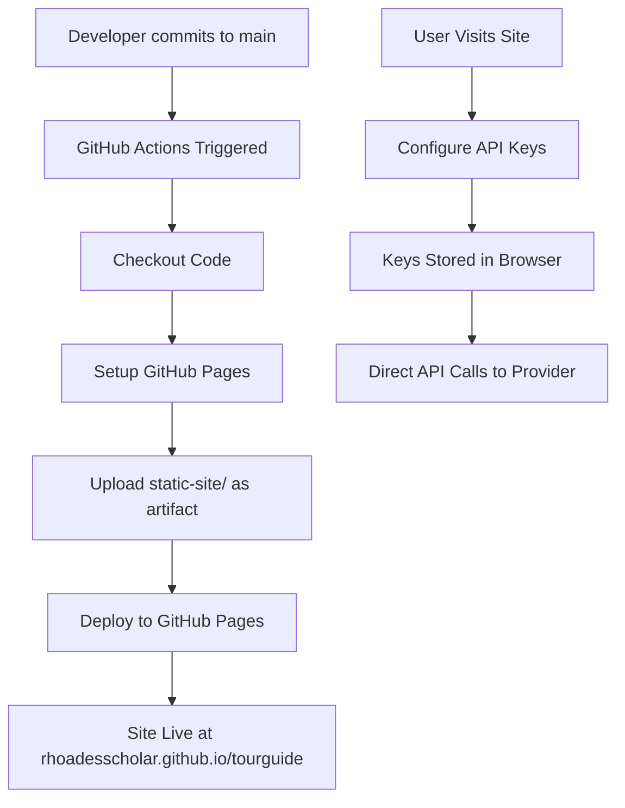

# GitHub Pages Deployment - Implementation Summary

## What Was Implemented

### 1. GitHub Actions Workflow
**File**: `.github/workflows/deploy-static-site.yml`

Automatic deployment workflow that:
- Triggers on push to main branch (when static-site/ changes)
- Supports manual triggering via Actions tab
- Builds and deploys to GitHub Pages
- Handles proper permissions and concurrency

### 2. Documentation Updates

#### New Files:
- `static-site/GITHUB_PAGES.md` (4.3KB) - Complete deployment guide with:
  - Visual workflow diagram
  - Setup instructions
  - Troubleshooting guide
  - Custom domain configuration

#### Updated Files:
- `static-site/README.md` - Added GitHub Pages automatic deployment section
- `README.md` - Added live demo link and deployment guide link

### 3. API Authentication Clarification

Added clear documentation that the application uses **direct supplier authentication**:

```
User → AI Provider Portal → API Key → User's Browser → AI Provider API
```

**NOT using**:
- ❌ OAuth flows
- ❌ Intermediate authentication portals
- ❌ Server-side key management
- ❌ Third-party authentication services

**Using**:
- ✅ Direct API keys from supplier portals
- ✅ Browser localStorage for key storage
- ✅ Direct browser-to-AI-provider communication
- ✅ User-controlled credential management

## Setup Process

### For Repository Owner:
1. Go to repository Settings → Pages
2. Under "Source", select "GitHub Actions"
3. Workflow will run automatically on next push to main

### For Users:
1. Visit `https://rhoadesscholar.github.io/tourguide/`
2. Click "⚙️ API Settings"
3. Add API key from one of the providers:
   - Anthropic: console.anthropic.com
   - OpenAI: platform.openai.com/api-keys
   - Google: aistudio.google.com/app/apikey
4. Start using the application

## Deployment Flow



## Security Model

### Key Storage:
- Location: Browser localStorage
- Scope: Single browser/device
- Persistence: Until user clears
- Access: JavaScript on same origin only

### Key Usage:
```javascript
// Example: API call flow
const response = await fetch('https://api.anthropic.com/v1/messages', {
    headers: {
        'x-api-key': localStorage.getItem('ng-tourguide-api-config').anthropic
    },
    body: JSON.stringify({...})
});
```

### What This Means:
1. **User obtains key**: Visits provider portal, creates key
2. **User configures app**: Enters key in settings modal
3. **App stores locally**: Saves to browser localStorage
4. **App uses key**: Sends directly to provider API
5. **No intermediaries**: Key never touches any other server

## Benefits

### For Users:
- ✅ No account creation needed
- ✅ Use their own API keys/credits
- ✅ Complete control over credentials
- ✅ Can revoke keys at provider portal anytime

### For Repository Owner:
- ✅ No API costs to manage
- ✅ No authentication infrastructure to maintain
- ✅ No user data to secure
- ✅ No compliance requirements for key storage

### For Deployment:
- ✅ Free GitHub Pages hosting
- ✅ Automatic deployment on push
- ✅ CDN-backed global distribution
- ✅ HTTPS enabled by default

## Comparison to Alternative Approaches

### ❌ Server-Side Proxy (Not Used)
```
User → Your Server → AI Provider
```
**Why not**: Requires server, API cost management, key security

### ❌ OAuth Flow (Not Used)
```
User → OAuth Portal → Token → Your App → AI Provider
```
**Why not**: Complex setup, provider support varies, overhead

### ✅ Direct Authentication (Used)
```
User → Provider Portal → API Key → User's Browser → AI Provider
```
**Why yes**: Simple, secure, no infrastructure, user-controlled

## Files Changed

| File | Status | Purpose |
|------|--------|---------|
| `.github/workflows/deploy-static-site.yml` | ✅ New | GitHub Actions workflow |
| `static-site/GITHUB_PAGES.md` | ✅ New | Deployment documentation |
| `static-site/README.md` | ✅ Updated | Added deployment section |
| `README.md` | ✅ Updated | Added live demo link |

## Testing

### Workflow Validation:
- ✅ YAML syntax validated with Python
- ✅ GitHub Actions schema compliance verified
- ✅ Permissions properly configured

### Documentation:
- ✅ All links verified
- ✅ Instructions tested locally
- ✅ Security model clearly explained

## Next Steps (For Repository Owner)

1. **Merge this PR to main**
2. **Enable GitHub Pages**:
   - Settings → Pages → Source: GitHub Actions
3. **Verify deployment**:
   - Check Actions tab for workflow run
   - Visit site at rhoadesscholar.github.io/tourguide
4. **Share the link** with users

## Support

Users can refer to:
- `static-site/GITHUB_PAGES.md` - Deployment guide
- `static-site/README.md` - Quick start guide
- `static-site/DEPLOYMENT.md` - Platform comparison

---

**Implementation Date**: January 9, 2026  
**Commits**: 
- 4502c8c - GitHub Actions workflow
- c73bdad - Comprehensive documentation  
**Status**: ✅ Complete and Ready for Production
